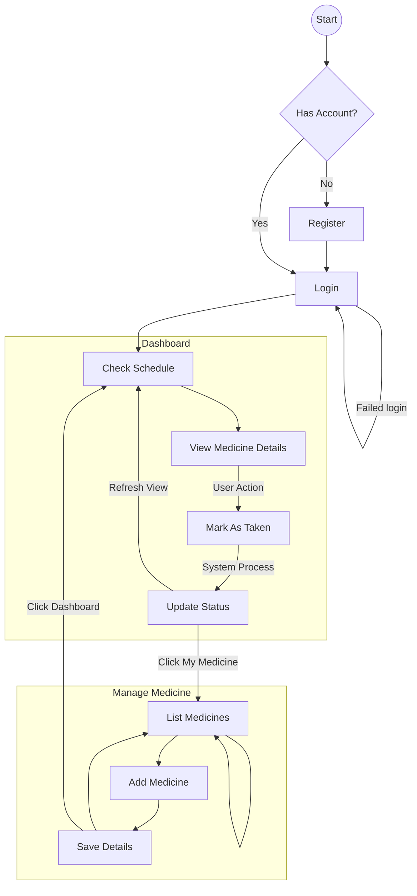
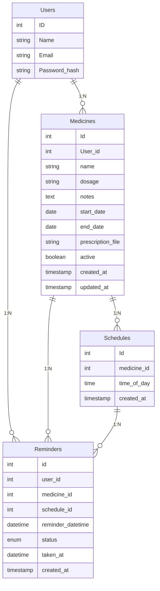
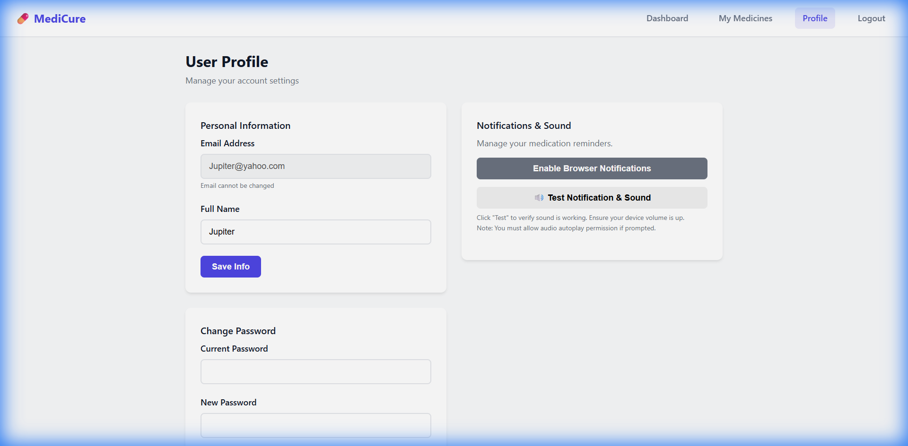
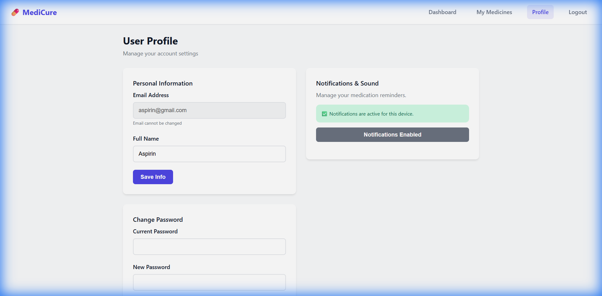

# Medicature Project Report

## 1. Project Overview
**Medicature** is a web-based medication management system designed to help patients and caregivers track medication schedules. It provides a user-friendly dashboard to manage prescriptions, a robust notification system to remind users when to take their medicine, and profile management features.

## 2. Key Features
*   **User Management**: Secure registration and login authentication.
*   **Profile Management**: Update personal details, change passwords, and manage notification settings.
*   **Medication Tracking**: Add, edit, and view medicines with specific dosages and schedules.
*   **Smart Notifications**: Real-time browser notifications with audible alarms to remind users of due medications.
*   **Dynamic Dashboard**: Visual overview of upcoming medications and adherence status.

## 3. System Diagrams

### 3.1. Use Case Diagram
This diagram illustrates the primary interactions between the User and the Medicature system.

```mermaid
usecaseDiagram
    actor User
    actor "Database System" as DB

    usecase "Register/Login" as UC1
    usecase "Manage Medicines" as UC2
    usecase "View Dashboard" as UC3
    usecase "Mark as Taken" as UC4
    usecase "Upload Prescription" as UC5

    User -- UC1
    User -- UC2
    User -- UC3
    User -- UC4
    
    UC1 -- DB
    UC2 -- DB
    UC3 -- DB
    UC4 -- DB

    UC2 ..> UC5 : <<include>>
    UC4 ..> UC3 : <<extend>>
```

### 3.2. Activity Diagram (Notification Flow)
The following activity diagram details the process of how the system triggers text and audio reminders for the user.



### 3.3. Database Diagram (ERD)
The database schema consists of users, medicines, schedules, and reminder logs.



## 4. User Interface Gallery

### Login Page
The entry point for the application, ensuring secure access.


### Profile Management
Users can update their personal information and securely change their passwords.


### Notification Settings
A simplified control panel to check the status of browser notifications and multiple confirmations of activity.

